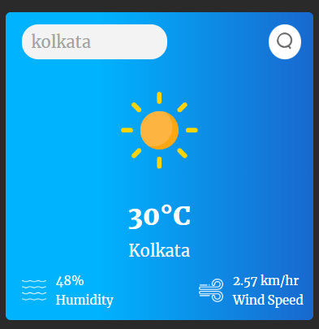

**Weather App using OpenWeather API**

This Weather App is a simple web application built with HTML, CSS, and JavaScript. It utilizes the OpenWeather API to fetch current weather data based on user input location. The app displays essential weather information like temperature, humidity, wind speed, and weather description.

## Live Demo:
https://bhagyadeep0.github.io/Basic-Weather-App/

## Features:
- **Current Weather Display**: Provides real-time weather information for the entered location.
- **Responsive Design**: Ensures the app is accessible and functional across various devices and screen sizes.
- **User-friendly Interface**: Simple and intuitive design for easy navigation and usage.

## Technologies Used:
- HTML5
- CSS3
- JavaScript (ES6)
- OpenWeather API

## Usage:
1. Clone the repository to your local machine.
2. Obtain an API key from [OpenWeather](https://openweathermap.org/) and replace `'YOUR_API_KEY'` in the `script.js` file with your API key.
3. Open the `index.html` file in a web browser.

## Preview:

  

  

## Credits:
- **OpenWeather API**: Used for fetching weather data.

## Author:
Bhagyadeep0
